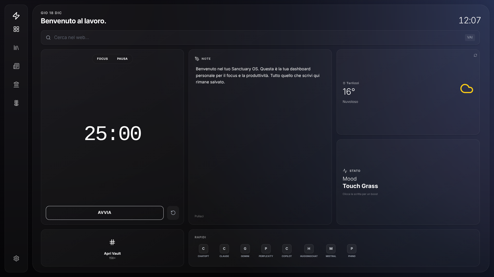

<!-- CENTERED HEADER WITH BADGES -->
<div align="center">

# 🌌 Sanctuary OS

> **Your digital shelter for focus, productivity, and aesthetics.**

<!-- Replace this link with your actual screenshot as soon as you can! -->


<br/>

<!-- BADGES (Shields.io) -->


<br/>

[**🚀 Launch Live Demo**](https://danwhs.github.io/sanctuary-os/)

</div>

---

## ⚡ About The Project

> **Sanctuary OS** is not your usual website. It is an ultra-lightweight **Progressive Web App (PWA)**, contained in a single file, designed to be your new browser homepage. It combines a stunning **Glassmorphism** interface with essential productivity tools and dynamic themes that react to your interactions.

* **Zero backend.**
* **Zero installation.**
* **Just pure HTML, CSS, and JS magic.**

---

## 🎨 Tech Stack

A clean and performant project based on standard technologies.

| Technology | Role | Badge |
| :--- | :--- | :--- |
| **HTML5** | Semantic Structure |  |
| **TailwindCSS** | Rapid Styling |  |
| **JavaScript** | Logic & Animations |  |
| **Lucide** | Vector Icons |  |

---

## ✨ Features

### 🎯 **Focus & Productivity**

* 🍅 **Pomodoro Timer**
    * Customizable modes: *Focus*, *Short Break*, and *Long Break*.
    * Visual countdown designed for flow state.

* 🧠 **Brain Dump**
    * A persistent scratchpad for your thoughts.
    * **Auto-save**: Notes are saved locally to your browser.

* 🤪 **Daily Status**
    * Daily "mood" status that rotates automatically.
    * Examples: *"Goblin Mode"*, *"Caffeina IV"*, *"NPC Mode"*.

---

### 🌌 **Dynamic Immersion**

Change the atmosphere with a click or via Easter Eggs.

| Theme | Vibe | Description |
| :--- | :--- | :--- |
| 🌌 **Aurora** | *Relaxed* | Default chill vibes with northern lights. |
| 🏛️ **Olympus** | *God-tier* | Bright, ethereal productivity environment. |
| ⛈️ **Thunder** | *Stormy* | Dark mode for intense coding sessions. |
| 🌧️ **Rain** | *Cozy* | Triggers animated rain on screen. |
| 🚀 **Astro** | *Sci-Fi* | Warp speed into deep space. |
| 🔥 **Fire** | *Intense* | Burning ember particles for warm focus. |

---

### 🛠 **The Vault**

A searchable database with **150+ curated tools**.

<details>
<summary><strong>📂 Click to expand Categories</strong></summary>
<br>

| Category | Examples |
| :--- | :--- |
| 🤖 **AI** | ChatGPT, Claude, Gemini, Perplexity |
| 💻 **Dev** | GitHub, Vercel, StackBlitz, Replit |
| 🎨 **Design** | Figma, Canva, Spline, Coolors |
| ⚡ **Productivity** | Notion, Trello, Obsidian, Slack |
| 🎓 **Study** | Wolfram, Zotero, Scholar |
| 🎧 **Chill** | Lofi Girl, Spotify, Rainymood |

</details>

---

## 🚀 Getting Started

Being a single file, setup is instantaneous.

### 🌐 Web (Easiest Method)
Simply visit the [**Live Demo Link**](https://danwhs.github.io/sanctuary-os/). It works on any modern browser.

### 📱 Mobile Installation (PWA)
1.  Open the site in **Safari** (iOS) or **Chrome** (Android).
2.  Tap **Share** -> **Add to Home Screen**.
3.  Launch it like a native app. Supports full-screen immersion.

### 💻 Local Development
1.  Clone the repo:
    ```bash
    git clone [https://github.com/danwhs/sanctuary-os.git](https://github.com/danwhs/sanctuary-os.git)
    ```
2.  Open `index.html` in your browser. Done.

---

## 🥚 Easter Eggs (Spoiler Alert!)

Want to unlock hidden themes? Try interacting with the UI elements.

| Hidden Theme | Trigger Action |
| :--- | :--- |
| ⚡ **Thunder** | Click the **"Stato"** (Status) card. |
| 🌧️ **Rain** | Click the **Weather** widget. |
| 🚀 **Astro** | Click the **Clock** in the top right. |
| 🔥 **Fire** | Click the title **"Benvenuto al lavoro"**. |
| 🌊 **Ripple** | Click the **Daily Status text** inside the card. |

---

## 🤝 Contributing

Got a cool idea? A new theme?

1.  **Fork** the project.
2.  Create your feature branch (`git checkout -b feature/AmazingFeature`).
3.  **Commit** your changes (`git commit -m 'Add some AmazingFeature'`).
4.  **Push** to the branch (`git push origin feature/AmazingFeature`).
5.  Open a **Pull Request**.

---

## 📄 License

Distributed under the **MIT License**. See `LICENSE` for more information.

---

<div align="center">

**Built with 💜 by Daniele Mastrorilli**

</div>
